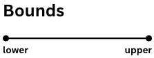
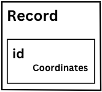
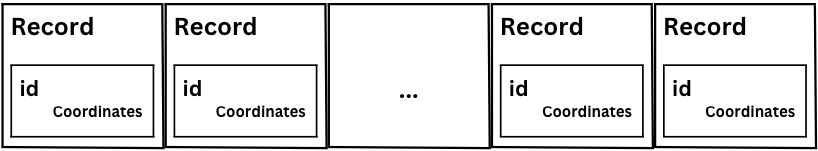
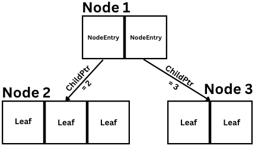
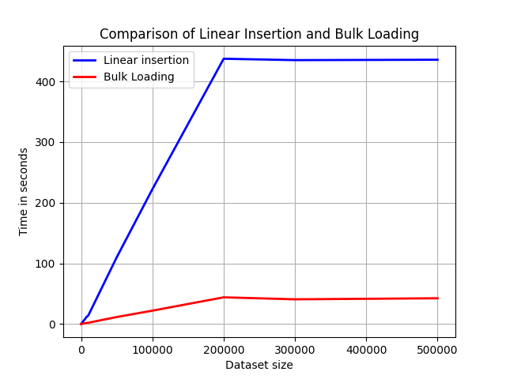
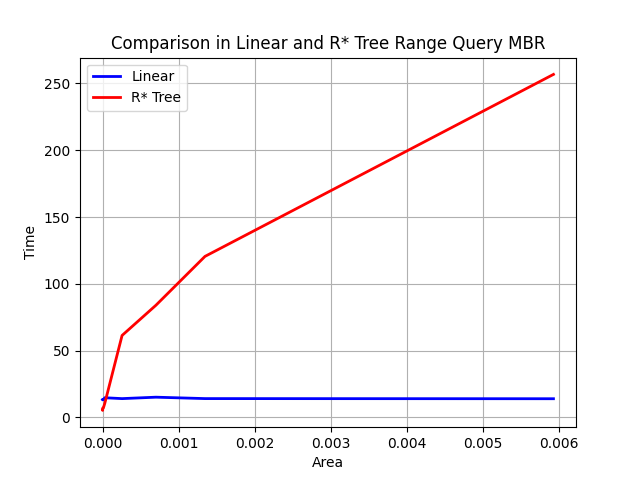
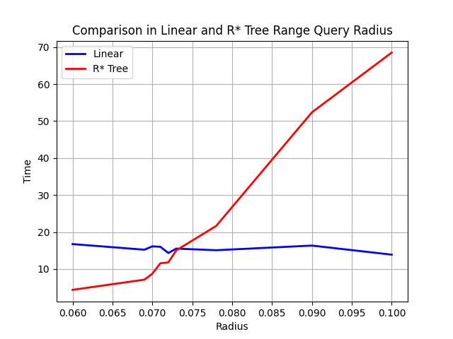
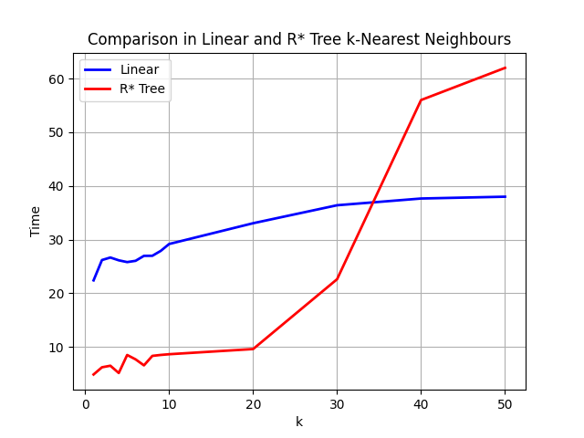
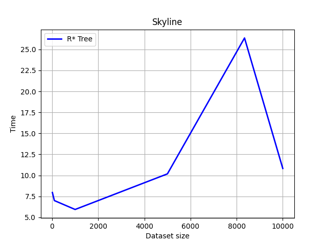

# R-Star-Tree
Implementation of R*-tree for spatial data organization and processing based on the paper:  
*Kriegel, HP., Kunath, P., Renz, M. (2008). R\*-Tree. In: Shekhar, S., Xiong, H.
(eds) Encyclopedia of GIS. Springer, Boston, MA.
https://doi.org/10.1007/978-0-387-35973-1_1148*

## Operations
The project was written in Java and contains the complete implementation of:
- Insertion 
- Record deletion
- Bulk loading using Hilbert Curve
- Range Query using a rectangle
- Range Query using a radius
- k Nearest Neighbors Query
- Skyline Query
## Architecture

### Bounds 
The bounds class represent a side of the MBR (Minimum Bounding Rectangle).

### Minimum Bounding Rectangle
The MBR class represent a Minimum Bounding Rectangle as defined in the paper [1].

### Record
The Record class represent a Record from the initial dataset, which has an id and a set of coordinates.

### DataBlock
The DataBlock class represent a block that is written and fetch to and from the dataFile. 
Consists of a set of records.

### Node Structure
The R*-tree consists of a set of Nodes. 
Each Node has a set of NodeEntries.
Each NodeEntry consists of a the child Node pointer and the MBR that containing the MBR of all the entries of the child Node.

## Performance
### Insertion
Comparison between linear insertion of records and bulk loading.

### Range Query using a Rectangle
Range Query execution comparison using the linear method and the R*-tree method.

### Range Query using a Radius
Range Query execution comparison using the linear method and the R*-tree method.

### Nearest Neighbors
k-NN execution comparison using the linear method and the R*-tree method.

### Skyline
Skyline perfomance using the R*-tree

## References
[1] Kriegel, HP., Kunath, P., Renz, M. (2008). R*-Tree. In: Shekhar, S., Xiong, H.
(eds) Encyclopedia of GIS. Springer, Boston, MA.
https://doi.org/10.1007/978-0-387-35973-1_1148  
[2] Antonin Guttman. 1984. R-trees: a dynamic index structure for spatial searching.
SIGMOD Rec. 14, 2 (June 1984), 47–57. https://doi.org/10.1145/971697.602266  
[3] Nick Roussopoulos, Stephen Kelley, and Frédéric Vincent. 1995. Nearest neighbor
queries. SIGMOD Rec. 24, 2 (May 1995), 71–79. https://doi.org/10.1145/568271.223794  
[4]Dimitris Papadias, Yufei Tao, Greg Fu, and Bernhard Seeger. 2003. An optimal and
progressive algorithm for skyline queries. In Proceedings of the 2003 ACM SIGMOD
international conference on Management of data (SIGMOD '03). Association for
Computing Machinery, New York, NY, USA, 467–478.
https://doi.org/10.1145/872757.872814 